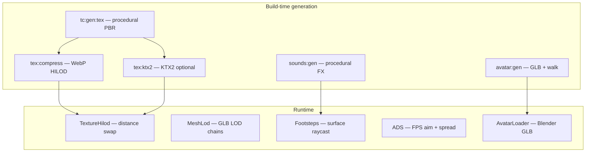

# Asset Capabilities — Dev & Reference Head Start

Threshold ships a **full starter pipeline** for realistic action games: procedural PBR textures with HILOD, WebP/KTX2 codecs, Blender import, rigged avatars, surface footstep SFX, and FPS combat (ADS).

**Current version:** v9.6.1 — showcase polish, survival depth, creator snippets, MP vitals sync (Sprints A–P)

---

## Capability map



---

## Texture presets (`config/tc-textures.json`)

| Style | Use case | Slots | Footstep surface |
|-------|----------|-------|------------------|
| `vehicle` | TC cars | albedo, roughness, metalness | — |
| `character` | TC pilots | albedo, roughness | — |
| `concrete` | Ground, slabs | albedo, roughness, normal | concrete |
| `wall` | Backdrops | albedo, roughness, normal | concrete |
| `grass` | Outdoor pads | albedo, roughness, normal | grass |
| `wood` | Decks, floors | albedo, roughness, normal | wood |
| `gravel` | Paths | albedo, roughness, normal | gravel |
| `asphalt` | Roads | albedo, roughness, normal | asphalt |
| `metal_grate` | Grates, industrial | albedo, roughness, metalness, normal | metal |
| `fabric` | Banners, cloth | albedo, roughness | default |
| `stripe` | Lane paint | albedo, roughness | asphalt |
| `terminal` | Kiosks, AI stations | albedo, roughness, metalness | — |

### HILOD tiers (distance `[0, 12, 28]` m)

| Suffix | Max px | Graphics tier |
|--------|--------|---------------|
| `_512` | 128 | compatibility |
| `_1k` | 256 | balanced |
| `_2k` | 512 | realistic |
| `_4k` | 1024 | ultra |
| base `.png` | 512 | source |

Runtime picks variant via `TextureHilod` + graphics profile `textureMax`.

### GIMP override

```bash
npm run gimp:install
# Filters → Threshold → Build TC Textures (R8)
```

See [GIMP_TEXTURES.md](GIMP_TEXTURES.md) — full parity with `tc-gen-tex.cjs`.

### GIMP live SYNC

```bash
npm run textures:watch   # terminal 1
npm run dev              # terminal 2
# GIMP Export PBR Maps → instant hot-reload in Engine
```

### Starter texture kit

```bash
npm run kit:export   # WebP base + _512 · ~2 MB fork pack
npm run kit:verify
```

Output: `exports/starter-texture-kit/`

### Starter UV tiling

`config/starter-textures.json` — per-object `uvRepeat` / `normalScale` after manifest bind (512px maps tile on 14m ground).

### Codecs

| Codec | Command | When used |
|-------|---------|-----------|
| PNG | `tex:gen` | Source of truth, GIMP overrides |
| WebP | `tex:compress` | Web delivery (ffmpeg) |
| KTX2 | `tex:ktx2` | Native / ultra (toktx or basisu on PATH) |

Runtime probe order: **KTX2 → WebP → PNG** when `__THRESHOLD_KTX2__` is enabled.

---

## Blender workflow

### Meshes & props

```bash
npm run blender:export -- --blend scene.blend --object "My Prop" --output import
npm run bundle:assets
```

Manifest: `import/threshold_blender_manifest.json`

### Avatars

See `docs/BLENDER_AVATARS.md` and `config/avatar-manifest.json`.

- Export **GLB**, Y-up, apply transforms
- Height auto-scaled to **1.75 m**
- Walk clip named `walk` (or first animation)
- Fallback: name nodes `legL`, `legR`, `armL`, `armR`
- Skinned rigs: `AnimationMixer` binds to first `SkinnedMesh`

Drop into `import/` → `npm run bundle:assets` → Model Kiosk or `avatarLoader` role map.

---

## Audio surfaces

| Surface | Clip ID | Tag collider |
|---------|---------|--------------|
| concrete | `starter_footstep_concrete` | `Physics.addStaticBox(..., 'concrete')` |
| metal | `starter_footstep_metal` | `'metal'` or id `*metal*` |
| grass | `starter_footstep_grass` | `'grass'` |
| wood | `starter_footstep_wood` | `'wood'` |
| gravel | `starter_footstep_gravel` | `'gravel'` |
| asphalt | `starter_footstep_asphalt` | `'asphalt'` |

Also set `mesh.userData.surfaceType` for raycast fallback.

---

## FPS combat

| Action | Key | Gamepad |
|--------|-----|---------|
| Fire | G | RT |
| Aim (ADS) | R (hold) | LT |
| Toggle FPS/TPS | V | D-pad Down |

ADS: FOV 75→42, viewmodel pulls to sights, tighter shot spread, slower strafe.

---

## One-shot pack pipeline

```bash
npm run assets:pack    # tex + avatar + sounds + webp + ktx2 + basis + build + bundle
npm run assets:verify
npm run sounds:verify
npm run preview
```

---

## Custom texture recipe

1. Add asset block to `config/tc-textures.json` (`slug`, `objectName`, `style`, `palette`, `slots`)
2. Add generator in `scripts/tc-gen-tex.cjs` `slotFn()` for your `style`
3. Match scene object `userData.name` to `objectName`
4. `npm run tex:gen && npm run tex:compress && npm run bundle:assets`
5. Optional GIMP override: TextureBridge SYNC on slot export

---

## Reference files

| Path | Purpose |
|------|---------|
| `config/tc-textures.json` | Texture preset registry |
| `config/avatar-manifest.json` | Avatar / Blender contract |
| `config/lod-distances.json` | Shared mesh + texture LOD distances |
| `textures/threshold_manifest.json` | Runtime texture binding |
| `docs/REALISTIC_GAMEPLAY.md` | Controls, survival, showcase site |
| `docs/BLENDER_AVATARS.md` | Rig export checklist |
| `docs/POLISH_ROADMAP.md` | Polish sprints L–R (complete) |

---

## v9 showcase & gameplay systems

| System | Module | Notes |
|--------|--------|-------|
| Guided session | `guidedSession.js` | PLAY/BUILD; `?mode=` deep link; guest skip |
| Showcase gateway | `showcaseGateway.js` | Sign, curbs, golden hour, rain lamps |
| Showcase snippets | `showcaseSnippets.js` | INSERT → gateway / terminals / survival prop |
| Survival vitals | `survivalNeeds.js` | 6 stats; TC handoff; collapse vignette |
| Survival zones | `survivalZones.js` | Passive + custom `ambientZone` markers |
| World hooks | `survivalWorldHooks.js` | Tag props; inspector `survivalKind` |
| Remote vitals pill | `remotePlayers.js` | HP/F/W above MP avatars (`avatar.v`) |
| Export preflight | `exportPreflight.js` | Warns missing survival hooks |
| Scene undo | `sceneHistory.js` | Labels: `action · BUILD/PLAY · author` |
| MP live sync | `sync.js` | `LIVE_STATE` + `sessionMode` + vitals |
| MP manifests | `audioManifestSync.js`, `textureManifestSync.js` | Host pushes blobs on join |
| Host handoff | `hostMigration.js` | Vitals + sessionMode in snapshot |
| Third Eye | `thirdEye.js` | Interactables + amber lock highlight |