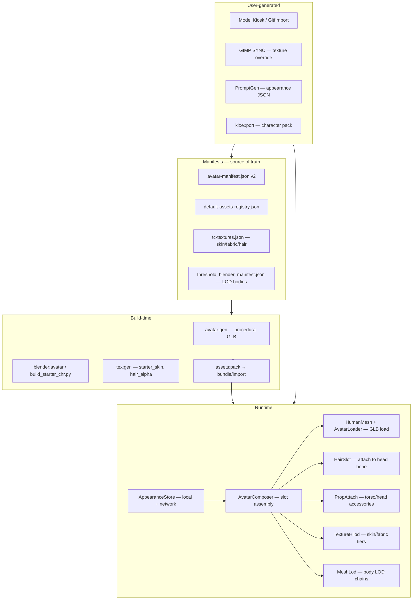

# R8.2 — Character Kit (Female Avatar + Hair + Future-Proof Composition)

**Status:** R8.2.0–R8.2.6 shipped · v7.8.3 · **Target:** R8.2.7 props attach  
**Prerequisite:** R8.1 registry scaffold ✅ · Phase 18.5 GLB+LOD pattern ✅  
**North star:** Basic defaults ship immediately; every slot is manifest-driven so user-generated GLBs, GIMP textures, Blender exports, and PromptGen outputs plug in without code changes.

---

## 1. Design principles

| Principle | Rule |
|-----------|------|
| **Manifest-first** | No hardcoded GLB paths in runtime — `avatar-manifest.json` + `default-assets-registry.json` are source of truth |
| **Composition over monolith** | Body + hair + textures + props are **slots**, not one baked mesh |
| **Graceful fallback** | Missing GLB → procedural `HumanMesh.build()` · missing hair → `hairCap` · missing texture → vertex color |
| **User override wins** | Model Kiosk / `import/` drop-in / Blender export can replace any default slot via manifest entry |
| **Sync the profile, not the mesh** | Multiplayer sends compact `AppearanceProfile` JSON; each client resolves locally from manifest |
| **Same pipeline as lab props** | `gen script → manifest → runtime compose → guest rebuild` (Phase 18.5 template) |

---

## 2. Architecture layers



---

## 3. Character composition model

A playable or NPC character is assembled from **five independent slots**:

| Slot | ID prefix | Default (basic) | User upgrade path |
|------|-----------|-----------------|-------------------|
| **Body** | `body_*` | `starter_avatar.glb` / `starter_avatar_female.glb` | Blender rigged GLB + LOD |
| **Hair** | `hair_*` | `hair_short_m.glb`, `hair_long_f.glb` | Separate GLB or child mesh; alpha HILOD |
| **Skin texture** | `starter_skin_*` | Procedural albedo tint | GIMP export · `tex:gen` palette variants |
| **Cloth texture** | `starter_fabric_*` | Vertex color on shirt/pants | PBR maps per garment region |
| **Props** | `prop_*` | None on player; `lab_coat` on Nikola NPC | Attach GLB to named bone (`torso`, `head`) |

### Named nodes contract (GLB)

Required for animation + attachment (matches `avatar-manifest.json`):

```
hips, torso, head, neck, legL, legR, armL, armR
hair_anchor     — optional; HairSlot parents here (fallback: head)
prop_torso      — optional; PropAttach anchor
prop_head       — optional; hats, goggles
hairCap         — procedural fallback; FPS hide list
```

### Height normalization

| Body ID | Target height | Notes |
|---------|---------------|-------|
| `male_default` | 1.75 m | Current player default |
| `female_default` | 1.65 m | Narrower torso scale in procedural fallback |

`HumanMesh.loadGltf` already ground-and-scales; manifest carries `heightM` per body.

---

## 4. AppearanceProfile — serializable state

Single object stored locally, exported in scenes, synced in multiplayer:

```json
{
  "format": "threshold-appearance",
  "version": 1,
  "bodyId": "female_default",
  "hairId": "hair_long_f",
  "colors": {
    "skin": "#e8b896",
    "shirt": "#3d5a80",
    "pants": "#232830",
    "hair": "#2a1810"
  },
  "textures": {
    "skin": "starter_skin_medium",
    "shirt": "starter_fabric",
    "hair": "hair_alpha"
  },
  "props": {
    "torso": null,
    "head": null
  },
  "customBodyGlb": null,
  "customHairGlb": null
}
```

**Resolution order:** `customBodyGlb` → manifest `bodies[bodyId].glb` → procedural fallback.

### Multiplayer extension

Extend `LIVE_STATE.playerAvatars[key]`:

```json
{
  "x": 0, "y": 0, "z": 0, "rotY": 0, "mode": "walk",
  "appearance": { "bodyId": "female_default", "hairId": "hair_long_f", "colors": { ... } }
}
```

`RemotePlayers` resolves `appearance` per key instead of hardcoding `starter_avatar.glb`.

---

## 5. Manifest v2 — `avatar-manifest.json`

Upgrade from v1 roles map to full character kit:

```json
{
  "format": "threshold-avatar-manifest",
  "version": 2,
  "defaultHeightM": 1.75,
  "preferredRoot": "StarterAvatar",
  "animationClips": ["walk", "Walk", "locomotion", "idle", "Idle"],
  "namedParts": ["legL", "legR", "armL", "armR", "torso", "head", "hips", "neck", "hair_anchor"],
  "fpsHideParts": ["head", "hairCap", "neck", "hair_*"],
  "attachPoints": {
    "hair": ["hair_anchor", "head"],
    "torso_prop": ["prop_torso", "torso"],
    "head_prop": ["prop_head", "head"]
  },
  "bodies": {
    "male_default": {
      "glb": "starter_avatar.glb",
      "heightM": 1.75,
      "lodManifestId": "starter_avatar",
      "fallback": { "torsoScale": [1.04, 1, 0.95] }
    },
    "female_default": {
      "glb": "starter_avatar_female.glb",
      "heightM": 1.65,
      "lodManifestId": "starter_avatar_female",
      "fallback": { "torsoScale": [0.92, 1, 0.88], "hipScale": [0.95, 1, 0.95] }
    }
  },
  "hair": {
    "hair_short_m": { "glb": "hair_short_m.glb", "attach": "hair_anchor", "fpsHide": true },
    "hair_long_f": { "glb": "hair_long_f.glb", "attach": "hair_anchor", "fpsHide": true },
    "hair_bun_f":  { "glb": "hair_bun_f.glb",  "attach": "hair_anchor", "fpsHide": true },
    "none":        { "procedural": "hairCap" }
  },
  "textures": {
    "skin":  { "slug": "starter_skin",  "slots": ["albedo", "roughness"], "hilod": true },
    "shirt": { "slug": "starter_fabric", "slots": ["albedo", "roughness"], "hilod": true },
    "hair":  { "slug": "hair_alpha",    "slots": ["albedo", "alpha"], "hilod": true, "transparent": true }
  },
  "roles": {
    "player":       { "bodyId": "male_default",   "hairId": "hair_short_m" },
    "guide_npc":    { "bodyId": "male_default",   "hairId": "hair_short_m" },
    "guard_npc":    { "glb": "starter_npc_guard.glb" },
    "mechanic_npc": { "glb": "starter_npc_mech.glb" },
    "tesla_guide":  { "bodyId": "male_default",   "hairId": "hair_short_m", "props": { "torso": "prop_lab_coat" } }
  }
}
```

**Backward compat:** v1 `roles.*.glb` still works; v2 adds `bodyId` / `hairId` resolution in `AvatarComposer`.

---

## 6. Registry alignment — `default-assets-registry.json`

| Category | Status after R8.2 | GLB outputs | HILOD slugs |
|----------|-------------------|-------------|-------------|
| `human_male` | shipped → extended | `starter_avatar` LOD scaffold | `starter_skin`, `starter_fabric` |
| `human_female` | planned → **shipped** | `starter_avatar_female` + LOD | same |
| `hair` | planned → **shipped** | 3 hair GLBs | `hair_alpha` |
| `prop_*` (accessories) | **scaffold** | `prop_lab_coat.glb` optional | — |

---

## 7. Build pipeline

### 7.1 Node procedural (defaults — ship first)

```bash
npm run avatar:gen    # extend gen-starter-avatar.cjs
```

| Output | Notes |
|--------|-------|
| `starter_avatar_female.glb` | Walk clip · named limbs · 1.65 m |
| `hair_short_m.glb` | Cap mesh parented to `hair_anchor` |
| `hair_long_f.glb` | Shoulder-length · alpha-friendly UV |
| `hair_bun_f.glb` | Optional third style |

Pattern: same as `gen-starter-lab.cjs` — `GLTFExporter` + quaternion walk tracks.

### 7.2 Textures

```bash
npm run tex:gen       # add starter_skin, starter_fabric, hair_alpha to tc-textures.json
npm run tex:compress  # WebP HILOD _512/_1k/_2k/_4k
```

| Slug | Style | Palette variants |
|------|-------|------------------|
| `starter_skin` | `character` | `light`, `medium`, `deep` |
| `starter_fabric` | `fabric` | neutral + 4 accent presets |
| `hair_alpha` | `fabric` | grayscale + alpha channel |

### 7.3 Blender (user / artist path)

```bash
blender --background --python plugins/threshold-blender/build_starter_chr.py
npm run blender:avatar -- --blend starter_chr.blend --object Armature --file starter_avatar_female.glb
npm run blender:export -- --blend starter_chr.blend --object "Starter Avatar Female" --slug starter_avatar_female --lod
```

`build_starter_chr.py` scaffolds male + female armatures + hair mesh objects (like `build_starter_lab.py`).

### 7.4 User drop-in workflow

1. Export GLB to `import/my_character.glb`
2. Register in `avatar-manifest.json` under `bodies.my_character` or set `AppearanceProfile.customBodyGlb`
3. `npm run bundle:assets` or creative watch hot-reload
4. Model Kiosk insert still works for one-off; manifest entry makes it persistent across sessions

### 7.5 Character pack export

Extend `kit:export` to emit:

```
kit/characters/
  manifest.json          # subset of avatar-manifest + appearance presets
  bodies/*.glb
  hair/*.glb
  textures/starter_skin_*
```

Store asset kind `character` already exists in `config/store-assets.json`.

---

## 8. Runtime modules (new / extended)

| Module | Responsibility |
|--------|----------------|
| **`avatarComposer.js`** | `compose(profile) → THREE.Group` — orchestrates body, hair, textures, props |
| **`appearanceStore.js`** | Read/write `AppearanceProfile` · localStorage · `PlayerController` binding |
| **`hairSlot.js`** | Load hair GLB · parent to `hair_anchor` · FPS visibility · dispose on swap |
| **`propAttach.js`** | Generic attach/detach for `prop_*` GLBs (lab coat, hats) |
| **`avatarLoader.js`** | Thin wrapper → delegates to `AvatarComposer` (keep `spawnHumanWithAvatar` API) |
| **`humanMesh.js`** | Keep procedural fallback · add `applyAppearanceMaterials(group, profile)` |
| **`textureHilod.js`** | Apply skin/fabric maps to named material regions on body |

### FPS contract (unchanged, extended)

- Hide: `head`, `neck`, `hairCap`, any mesh matching `hair_*` or `fpsHide: true`
- Viewmodel arms remain separate (`fpsViewmodel.js`)

### NPC spawn contract

```js
spawnHumanWithAvatar({
  id: 'tesla_guide',
  appearance: { bodyId: 'male_default', hairId: 'hair_short_m', props: { torso: 'prop_lab_coat' } },
});
```

`starterScene.js` / `starterTeslaNpc183.js` migrate from inline `appearance: { colors }` to profile IDs.

---

## 9. UI / player-facing customization

### Skin panel (`SceneDock` → skin tab)

| Control | Binds to | Phase |
|---------|----------|-------|
| Body preset dropdown | `appearance.bodyId` | R8.2.2 |
| Hair style dropdown | `appearance.hairId` | R8.2.2 |
| Color pickers (skin/shirt/pants/hair) | `appearance.colors` | exists · wire to profile |
| Texture variant dropdown | `appearance.textures.skin` | R8.2.4 |
| Custom GLB picker | `appearance.customBodyGlb` | R8.2.6 |
| Export appearance JSON | clipboard / PromptGen | R8.2.6 |

**PLAY mode:** players edit own profile only (existing `SimMode.canEditPlayerSkin()`).  
**EDIT mode:** host can set NPC role defaults in manifest.

### PromptGen integration

PromptGen outputs can:

- Emit `AppearanceProfile` JSON → `AppearanceStore.apply()`
- Suggest texture slug additions → user runs `tex:gen` with new palette
- Reference manifest body/hair IDs for narrative consistency ("Nikola uses `tesla_guide` role")

---

## 10. LOD + HILOD for characters

### Mesh LOD

| Asset | LOD0 | LOD1 | LOD2 |
|-------|------|------|------|
| `starter_avatar` | Full limbs + face | No fingers/face detail | Capsule silhouette |
| `starter_avatar_female` | Same tier budget | Same | Same |
| Hair | Always LOD0 on player | — | Hidden at 28 m |

Distances: `config/lod-distances.json` → `[0, 18, 48]` m · `MeshLod.update()` (Neg unlit later ~100m).

Collider: always LOD0 bounding box (existing physics pattern).

### Texture HILOD

| Slug | Camera distance swap | Graphics profile cap |
|------|---------------------|----------------------|
| `starter_skin` | `TextureHilod.update()` | `_512` mobile · `_2k` realistic |
| `starter_fabric` | per-garment material | same |
| `hair_alpha` | alpha test + lower tier at distance | `_1k` max for hair |

---

## 11. Guest sync + scene export

### Guest rebuild

Marker pattern (like Tesla lab):

| Marker | Rebuild fn |
|--------|------------|
| `player` spawn | `PlayerController` uses `AppearanceStore` on join |
| NPC `userData.id` | existing `sync.js` chunk rebuild + `AvatarComposer` |
| Remote player | `appearance` in `LIVE_STATE` → `RemotePlayers` compose |

### Scene / game export

Extend `gameExport.js` / `sceneContext.js`:

```json
{
  "playerAppearance": { "bodyId": "female_default", ... },
  "npcAppearances": {
    "tesla_guide_npc": { "role": "tesla_guide", "colors": { ... } }
  }
}
```

Exported games bundle referenced GLBs + texture slugs from manifest.

---

## 12. Implementation phases (incremental ship)

| Phase | Version | Deliverable | Default quality |
|-------|---------|-------------|-----------------|
| **R8.2.0** | 7.8.0 | Manifest v2 schema + `AppearanceProfile` type + docs | Schema only |
| **R8.2.1** | 7.8.0 | `starter_avatar_female.glb` + 2 hair GLBs via `avatar:gen` | Basic procedural |
| **R8.2.2** | 7.8.1 | `AvatarComposer` + body/hair dropdowns in skin panel | Player can swap |
| **R8.2.3** | 7.8.1 | `HairSlot` attach · FPS hide · Nikola hair | Runtime compose |
| **R8.2.4** | 7.8.2 | `starter_skin` + `starter_fabric` tex gen + HILOD apply | Tint → PBR |
| **R8.2.5** | 7.8.2 | `appearance` in `LIVE_STATE` · remote female bodies | Multiplayer parity |
| **R8.2.6** | 7.8.3 | Custom GLB override + appearance export + kit:export characters | User path open |
| **R8.2.7** | 7.8.3 | `prop_lab_coat` attach · `build_starter_chr.py` Blender scaffold | NPC props |
| **R8.4** | 7.9+ | Full Blender LOD batch for bodies (was planned 7.7) | Artist quality |

Each phase is independently shippable; later phases never break manifest v2 contracts.

---

## 13. Verification

```bash
npm run avatar:gen
npm run tex:gen
npm run tex:compress
npm run assets:pack
npm run assets:verify   # extend: female + hair GLBs
npm run build
```

**Manual checklist:**

- [ ] Player spawn female body · walk anim plays
- [ ] Hair swap · FPS hides hair · TPS shows hair
- [ ] Remote guest sees host female body + hair
- [ ] GIMP SYNC skin texture hot-reload on body
- [ ] Model Kiosk custom GLB overrides `customBodyGlb`
- [ ] `kit:export` includes character pack folder
- [ ] Scene export restores `AppearanceProfile` on load

---

## 14. What stays basic (defaults)

Shippable defaults are intentionally low-poly procedural boxes/spheres — same tier as current `starter_avatar.glb`:

- Female body = scaled proportions, not sculpted mesh
- Hair = simple cap / drape mesh, not groom
- Skin = albedo tint or 512 procedural map, not pore detail
- Props = none on player; optional lab coat box on Nikola

**The architecture is the product.** Users bring Blender sculpts, GIMP skins, and PromptGen directions; the kit resolves and composes them.

---

## 15. Cross-links

| Doc | Relevance |
|-----|-----------|
| [old/docs/DEFAULT_ASSETS_ROADMAP.md](../old/docs/DEFAULT_ASSETS_ROADMAP.md) | R8.x version map (archived) |
| [BLENDER_AVATARS.md](BLENDER_AVATARS.md) | Export contract · extend with hair + attach points |
| [ASSET_CAPABILITIES.md](ASSET_CAPABILITIES.md) | HILOD + MeshLod overview |
| [old/docs/PHASE_18_TESLA_LAB.md](../old/docs/PHASE_18_TESLA_LAB.md) | Prop GLB + LOD pattern (archived) |
| `config/avatar-manifest.json` | Implement v2 here |
| `config/default-assets-registry.json` | Status bumps per category |

---

## 16. Open decisions (resolve during R8.2.0)

| Question | Recommendation |
|----------|----------------|
| Hair as child in body GLB vs separate GLB? | **Separate GLB** — enables swap without re-exporting body |
| Skinned hair vs rigid attach? | **Rigid to `hair_anchor`** for v1; skinned hair in R8.4 Blender pass |
| Material regions on GLB? | Named materials `skin`, `shirt`, `pants` on meshes for texture apply |
| Female player default? | **Opt-in** via skin panel; spawn stays male until user selects |