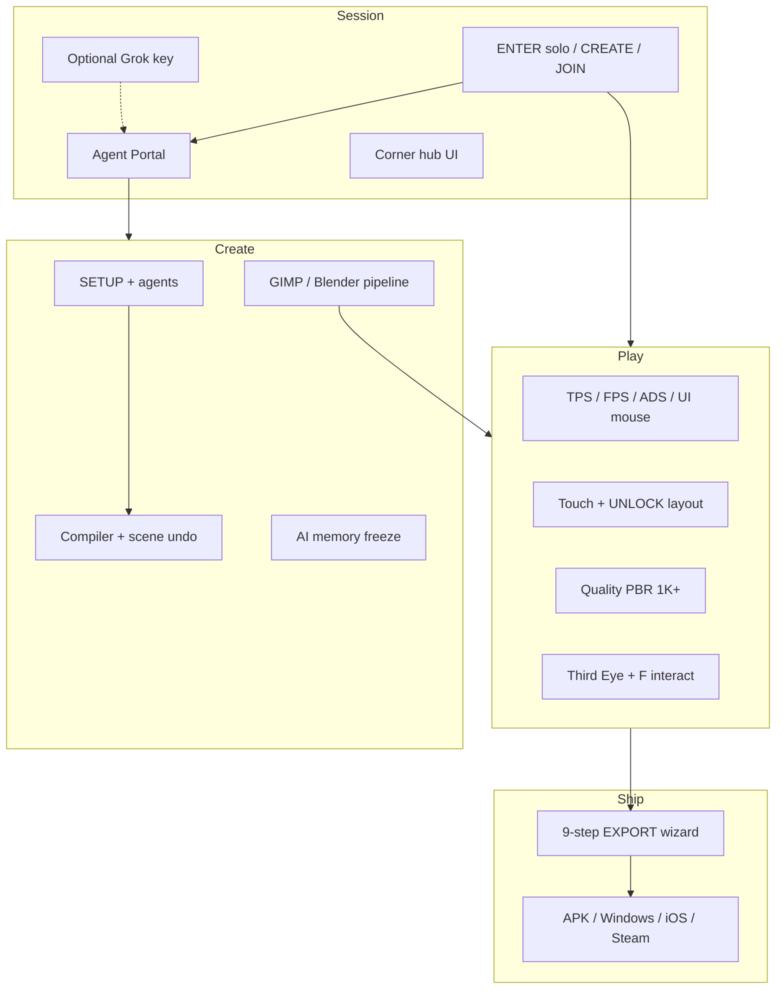

# Threshold documentation index

**Version:** 10.13.11 · **Live:** https://medicinalsheep.github.io/threshold/

Full scope map — quality-first blank grid, optional TC reference editions, and where to read more.

**Start here (agents & forks):** [BUILD_FROM.md](BUILD_FROM.md) · **Snapshot:** [CAPABILITIES.md](CAPABILITIES.md) · **Forward plan:** [ROADMAP.md](ROADMAP.md) · **Changelog:** [CHANGELOG.md](CHANGELOG.md)

---

## Content layers

| Layer | What | Policy |
|-------|------|--------|
| **Your game** | Blank grid + quality-gated AI + PBR export | Default path since 10.0; min 1K textures since 10.11 |
| **TC editions** | Lobby → **TC DEMO** — vehicles, circuit, export demo | Bundled reference only — [THRESHOLD_CHILD_ASSETS.md](THRESHOLD_CHILD_ASSETS.md) |

Legacy edition manifests (`threshold-child-*`) live in `old/reference-editions/` — active ids are `tc-*`.

---

## Capability map (v10.13)



---

## Start here (pick your path)

| I want to… | Read | Run |
|------------|------|-----|
| One-page outline (humans + agents) | [BUILD_FROM.md](BUILD_FROM.md) | Live URL or clone |
| Play immediately | [README.md](../README.md) Quick start | Live URL → **ENTER →** |
| Clone & develop | [GETTING_STARTED.md](GETTING_STARTED.md) | `npm install` → `npm run quickstart` |
| Streamlined dev path | [STREAMLINED_DEV.md](STREAMLINED_DEV.md) | Portal → SETUP → EXPORT |
| Grok API key (optional) | [AUTH.md](AUTH.md) | Not required to play |
| Agent tiers & benchmarks | [AGENT_ROUTING.md](AGENT_ROUTING.md) | `ollama:benchmark` · SMART DEV |
| UI layout + agents | [UI_AND_AGENTS.md](UI_AND_AGENTS.md) | Portal · freeze · touch · UNLOCK |
| Train mini agents | [BOOTCAMP.md](BOOTCAMP.md) · [MODEL_DISTRIBUTION.md](MODEL_DISTRIBUTION.md) | `npm run train:mini -- --no-seed` · `ollama:golden` |
| Android APK (after polish) | [ANDROID_PREP.md](ANDROID_PREP.md) · [STORE_RELEASE.md](STORE_RELEASE.md) | `npm run package:android` |
| Action controls | [CONTROLS.md](CONTROLS.md) | LMB aim · RMB shoot · F interact · PTT **N** |
| Creative loop | [CREATIVE_WORKFLOW.md](CREATIVE_WORKFLOW.md) | BUILD → insert · PromptGen |
| Full asset pipeline | [ASSET_CAPABILITIES.md](ASSET_CAPABILITIES.md) | `npm run assets:pack` |
| TC export practice | [REFERENCE_EDITIONS.md](REFERENCE_EDITIONS.md) | Lobby → **TC DEMO** |
| Ship to stores | [EXPORT_WALKTHROUGH.md](EXPORT_WALKTHROUGH.md) | TOOLS → EXPORT → `store:prep` |

---

## Command cheat sheet

```bash
npm run quickstart              # onboarding (+ --verify / --pack)
npm run dev                     # Vite dev server
npm run ollama:serve            # CORS proxy for Pages + localhost Ollama
npm run assets:pack             # full starter pipeline
npm run assets:verify           # smoke test
npm run preview                 # production preview :4173
npm run textures:watch          # GIMP live SYNC (with dev)
npm run tc:build                # TC GLBs + textures
npm run controls:verify         # binding defaults + doc truth
npm run store:verify            # packaging E2E smoke
npm run models:mini             # install mini agents
npm run build:icons             # favicon ladder from appicon512.png
npm run build                   # GitHub Pages → dist-pages/
```

---

## All guides

| Doc | Topic |
|-----|-------|
| [BUILD_FROM.md](BUILD_FROM.md) | **One-page spine** — live link, loop, do/don’t |
| [GETTING_STARTED.md](GETTING_STARTED.md) | Lobby → ship linear path |
| [AUTH.md](AUTH.md) | Optional Grok API key (no X OAuth) |
| [PERF_NEXT.md](PERF_NEXT.md) | Neg LOD tier auto, multi-mat, floor, measure harness |
| [MULTIPLAYER.md](MULTIPLAYER.md) | Room codes, PeerJS, join troubleshooting |
| [NEGATIVE_LOD.md](NEGATIVE_LOD.md) | Design: far-field unlit shader LOD (`negativeLOD`) |
| [../extension/threshold-chrome/README.md](../extension/threshold-chrome/README.md) | Chrome: local mini → Grok tab paste |
| [ROADMAP.md](ROADMAP.md) | v10.8+ forward plan |
| [PRODUCT_ROADMAP.md](PRODUCT_ROADMAP.md) | Vision + pillars |
| `old/docs/REALISTIC_GAMEPLAY.md` | Archived — survival + showcase (pre-10.11) |
| [CREATIVE_WORKFLOW.md](CREATIVE_WORKFLOW.md) | GIMP/Blender loop |
| [ASSET_CAPABILITIES.md](ASSET_CAPABILITIES.md) | HILOD, codecs, asset systems |
| [AGENT_ROUTING.md](AGENT_ROUTING.md) | Tiered agents + bootcamp |
| [MODEL_DISTRIBUTION.md](MODEL_DISTRIBUTION.md) | GitHub vs local weights |
| [CAPABILITIES.md](CAPABILITIES.md) | Progress snapshot |
| [UI_AND_AGENTS.md](UI_AND_AGENTS.md) | Lobby, hubs, freeze, touch, optional Grok |
| [STORE_VERIFY.md](STORE_VERIFY.md) | Store/native verify plan |
| [GIMP_TEXTURES.md](GIMP_TEXTURES.md) | GIMP install, batch, live SYNC |
| [BLENDER_AVATARS.md](BLENDER_AVATARS.md) | Rigged GLB export |
| [EXPORT_WALKTHROUGH.md](EXPORT_WALKTHROUGH.md) | 9-step export wizard |
| [CHANGELOG.md](CHANGELOG.md) | Version history |

**Archived phase history:** [old/docs/](../old/docs/)

Agent/contributor guide: [AGENTS.md](../AGENTS.md)