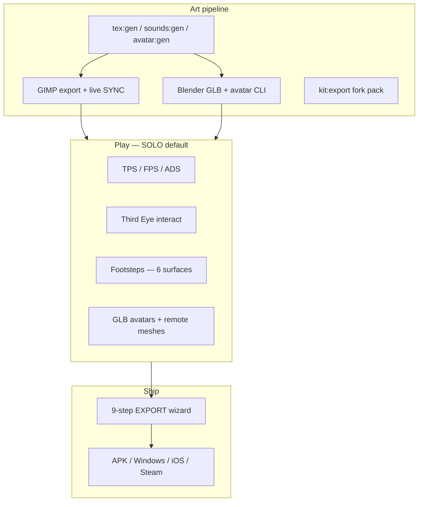

# Threshold documentation index

**Version:** 7.1.0 · **Live:** https://medicinalsheep.github.io/threshold/

This page is the **full scope map** — what ships today, what is TC vs starter vs yours, and where to read more.

---

## Three content layers

| Layer | What | Policy |
|-------|------|--------|
| **Starter scene** | Lobby → **SOLO PLAY** — walk/FPS action template, PBR pads, NPCs, SFX | Original Threshold defaults; regenerate with `assets:pack` |
| **TC editions** | Lobby → **TC →** — vehicles, characters, circuit, export demo | Original bundled reference — [THRESHOLD_CHILD_ASSETS.md](THRESHOLD_CHILD_ASSETS.md) |
| **Your game** | Worlds you build, GIMP/Blender art, export manifest | You source and credit your assets |

Legacy edition manifests (`threshold-child-*`) live in `old/reference-editions/` — active ids are `tc-*`.

---

## Capability map (v6.4)



---

## Start here (pick your path)

| I want to… | Read | Run |
|------------|------|-----|
| Play immediately | [README.md](../README.md) Quick start | Open live URL → **SOLO PLAY** |
| Clone & develop locally | [GETTING_STARTED.md](GETTING_STARTED.md) | `npm install` → `npm run quickstart` |
| Realistic action defaults | [REALISTIC_GAMEPLAY.md](REALISTIC_GAMEPLAY.md) | Lobby → SOLO → walk pads, FPS, ADS |
| FiveM-style controls | [CONTROLS_FIVEM.md](CONTROLS_FIVEM.md) | LMB/RMB · F vehicle · KEYS menu |
| Ambient + weather | [AMBIENT_ASSETS_ROADMAP.md](AMBIENT_ASSETS_ROADMAP.md) | Real rain/thunder, recorded foley, roadmap |
| Session stability | [PHASE_13_STABILITY.md](PHASE_13_STABILITY.md) | Audio cache, weather sync, pointer lock |
| Full asset pipeline | [ASSET_CAPABILITIES.md](ASSET_CAPABILITIES.md) | `npm run assets:pack` → `assets:verify` |
| GIMP textures | [GIMP_TEXTURES.md](GIMP_TEXTURES.md) | `gimp:install` + `textures:watch` + `dev` |
| Blender avatars | [BLENDER_AVATARS.md](BLENDER_AVATARS.md) | `blender:avatar` |
| TC export practice | [REFERENCE_EDITIONS.md](REFERENCE_EDITIONS.md) | Lobby → **TC →** → EXPORT |
| Ship to stores | [EXPORT_WALKTHROUGH.md](EXPORT_WALKTHROUGH.md) | MORE → EXPORT → `store:prep` |

---

## Phase history (realism + assets)

| Phase | Version | Shipped |
|-------|---------|---------|
| **7** | 6.1.0 | GLB avatars, footsteps, FPS viewmodel, remote meshes, WebP HILOD |
| **8** | 6.2.0 | 6 texture presets, `_4k` HILOD, KTX2 scaffold, ADS, surface pads |
| **9** | 6.3.0 | GIMP r8 parity, `starter-textures.json` UV tiling, `blender:avatar` |
| **10** | 6.4.0 | GIMP live SYNC, `kit:export` starter texture pack (~1.4 MB) |
| **10.1** | 6.4.1 | Doc truth pass, `old/` archive, `quickstart` onboarding |
| **11** | 6.5.0 | FiveM controls, procedural ambient iteration 1, starter scene props |
| **12** | 6.6.0 | Real weather + combat SFX, user recording tags, `WeatherSystem` |
| **13** | 6.7.0 | Manifest audio cache, weather multiplayer sync, pointer/pause hardening |
| **14** | 6.8.0 | Creek, power lines, fence rattle, dirt mound + dust |
| **15** | 6.9.0 | Dog/cat wildlife, cicadas/crickets, owl, fish splash |
| **16** | 7.0.0 | Highway Doppler passes, siren, construction beep, traffic lights, billboard |
| **17** | 7.1.0 | Radio chatter, coffee murmur, door creak, elevator ding, cash register |

Earlier phases (export, TC, circuit, Steam): [NEXT_PHASES.md](NEXT_PHASES.md) · [CHANGELOG.md](CHANGELOG.md)

---

## Command cheat sheet

```bash
npm run quickstart              # onboarding steps (+ --verify / --pack)
npm run dev                     # Vite dev server
npm run assets:pack             # full starter pipeline
npm run assets:verify           # smoke test
npm run preview                 # production preview :4173
npm run textures:watch          # GIMP live SYNC (with dev)
npm run kit:export              # fork-friendly WebP pack
npm run tc:build                # TC GLBs + textures
npm run tc:verify               # TC smoke test
npm run sounds:fetch:sfx        # real guns/impacts/footsteps (Mixkit)
npm run sounds:fetch:ambient    # real rain/thunder
npm run sounds:tag:recording    # clip user field recording
```

---

## All guides

| Doc | Topic |
|-----|-------|
| [GETTING_STARTED.md](GETTING_STARTED.md) | Lobby → ship linear path |
| [REALISTIC_GAMEPLAY.md](REALISTIC_GAMEPLAY.md) | Controls, NPCs, textures, audio, physics |
| [ASSET_CAPABILITIES.md](ASSET_CAPABILITIES.md) | Full dev head-start (HILOD, codecs, presets) |
| [GIMP_TEXTURES.md](GIMP_TEXTURES.md) | GIMP install, batch, live SYNC |
| [BLENDER_AVATARS.md](BLENDER_AVATARS.md) | Rigged GLB export |
| [CREATIVE_WORKFLOW.md](CREATIVE_WORKFLOW.md) | GIMP/Blender/Engine loop |
| [CREATIVE_PLUGINS.md](CREATIVE_PLUGINS.md) | Plugin implementation detail |
| [THRESHOLD_CHILD_ASSETS.md](THRESHOLD_CHILD_ASSETS.md) | TC original-asset policy |
| [REFERENCE_EDITIONS.md](REFERENCE_EDITIONS.md) | TC edition registry |
| [EXPORT_WALKTHROUGH.md](EXPORT_WALKTHROUGH.md) | 9-step export wizard |
| [STORE_RELEASE.md](STORE_RELEASE.md) | Play / App Store / Windows |
| [STEAM_RELEASE.md](STEAM_RELEASE.md) | Steam depot |
| [STORE_ASSETS.md](STORE_ASSETS.md) | IAP / registry maps |
| [NATIVE_SHELLS.md](NATIVE_SHELLS.md) | Capacitor + Electron |
| [PRODUCT_ROADMAP.md](PRODUCT_ROADMAP.md) | North star + open work |
| [NEXT_PHASES.md](NEXT_PHASES.md) | Detailed phase checklist |
| [CHANGELOG.md](CHANGELOG.md) | Version history |

Agent/contributor guide: [AGENTS.md](../AGENTS.md)