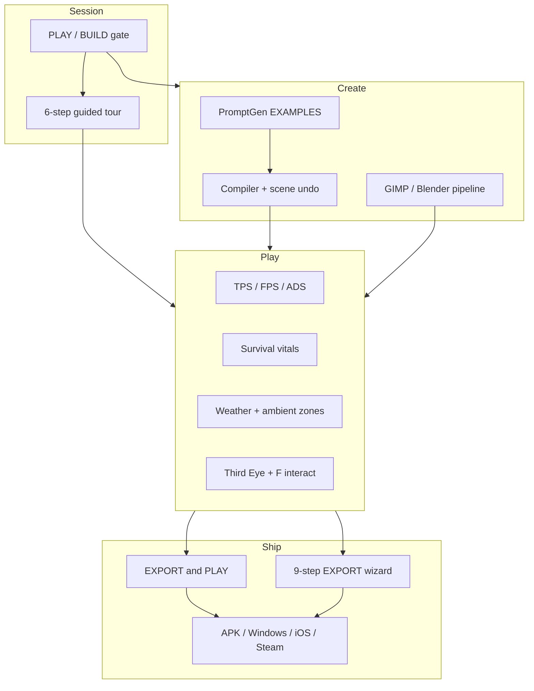

# Threshold documentation index

**Version:** 9.0.0 · **Live:** https://medicinalsheep.github.io/threshold/

This page is the **full scope map** — what ships today, what is TC vs showcase vs yours, and where to read more.

**Polish forward:** [POLISH_ROADMAP.md](POLISH_ROADMAP.md) · **Changelog:** [CHANGELOG.md](CHANGELOG.md)

---

## Three content layers

| Layer | What | Policy |
|-------|------|--------|
| **Showcase site** | Lobby → **PLAY/BUILD** → **ENTER** — Wardenclyffe lab GLBs, survival, weather | Original Threshold defaults; `assets:pack` |
| **TC editions** | Lobby → **TC →** — vehicles, circuit, export demo | Original bundled reference — [THRESHOLD_CHILD_ASSETS.md](THRESHOLD_CHILD_ASSETS.md) |
| **Your game** | Worlds you build, GIMP/Blender art, export manifest | You source and credit your assets |

Legacy edition manifests (`threshold-child-*`) live in `old/reference-editions/` — active ids are `tc-*`.

---

## Capability map (v9.0)



---

## Start here (pick your path)

| I want to… | Read | Run |
|------------|------|-----|
| Play immediately | [README.md](../README.md) Quick start | Live URL → **ENTER** |
| Clone & develop | [GETTING_STARTED.md](GETTING_STARTED.md) | `npm install` → `npm run quickstart` |
| Showcase + controls | [REALISTIC_GAMEPLAY.md](REALISTIC_GAMEPLAY.md) | PLAY mode · gateway · survival |
| Creative loop | [CREATIVE_WORKFLOW.md](CREATIVE_WORKFLOW.md) | BUILD → PromptGen EXAMPLES |
| FiveM-style controls | [CONTROLS_FIVEM.md](CONTROLS_FIVEM.md) | F interact · E vehicle |
| Ambient + weather | [AMBIENT_ASSETS_ROADMAP.md](AMBIENT_ASSETS_ROADMAP.md) | Rain, creek, interior zones |
| Full asset pipeline | [ASSET_CAPABILITIES.md](ASSET_CAPABILITIES.md) | `npm run assets:pack` |
| TC export practice | [REFERENCE_EDITIONS.md](REFERENCE_EDITIONS.md) | Lobby → **TC →** |
| Ship to stores | [EXPORT_WALKTHROUGH.md](EXPORT_WALKTHROUGH.md) | MORE → EXPORT → `store:prep` |

---

## Sprint history (v8–9)

| Sprint | Version | Shipped |
|--------|---------|---------|
| **A** | 8.0 | Scene undo, compile sandbox, Grok no-clearWorld |
| **B** | 8.1 | Performance HUD, sync chip |
| **C** | 8.2 | Starter templates, PromptGen cookbook |
| **D** | 8.3 | Nikola NPC, dusk lighting |
| **E** | 8.4 | EXPORT & PLAY, export preflight |
| **F** | 8.5 | Action hints, skippable intro (removed in K) |
| **G** | 8.6 | Guest rebuild, audio manifest, sync story |
| **H** | 8.7 | Scene lock, AI ack, texture manifest |
| **I** | 8.8 | Rebuild telemetry, per-author undo, host handoff |
| **J** | 8.9 | Survival vitals (6 stats, zones, HUD, MP) |
| **K** | 9.0 | Guided PLAY/BUILD, showcase gateway, gut intro |
| **Q** | 9.1 | Documentation truth pass |

Earlier phases (export, TC, circuit, Steam, realism v6–7): [NEXT_PHASES.md](NEXT_PHASES.md)

---

## Command cheat sheet

```bash
npm run quickstart              # onboarding (+ --verify / --pack)
npm run dev                     # Vite dev server
npm run assets:pack             # full starter pipeline
npm run assets:verify           # smoke test
npm run preview                 # production preview :4173
npm run textures:watch          # GIMP live SYNC (with dev)
npm run tc:build                # TC GLBs + textures
npm run tc:verify               # TC smoke test
```

---

## All guides

| Doc | Topic |
|-----|-------|
| [GETTING_STARTED.md](GETTING_STARTED.md) | Lobby → ship linear path |
| [REALISTIC_GAMEPLAY.md](REALISTIC_GAMEPLAY.md) | Controls, survival, showcase site |
| [CREATIVE_WORKFLOW.md](CREATIVE_WORKFLOW.md) | PLAY/BUILD, GIMP/Blender loop |
| [ASSET_CAPABILITIES.md](ASSET_CAPABILITIES.md) | HILOD, codecs, v9 systems table |
| [POLISH_ROADMAP.md](POLISH_ROADMAP.md) | Sprints L–P forward plan |
| [GIMP_TEXTURES.md](GIMP_TEXTURES.md) | GIMP install, batch, live SYNC |
| [BLENDER_AVATARS.md](BLENDER_AVATARS.md) | Rigged GLB export |
| [EXPORT_WALKTHROUGH.md](EXPORT_WALKTHROUGH.md) | 9-step export wizard |
| [PRODUCT_ROADMAP.md](PRODUCT_ROADMAP.md) | North star |
| [NEXT_PHASES.md](NEXT_PHASES.md) | Detailed phase checklist |
| [CHANGELOG.md](CHANGELOG.md) | Version history |

Agent/contributor guide: [AGENTS.md](../AGENTS.md)